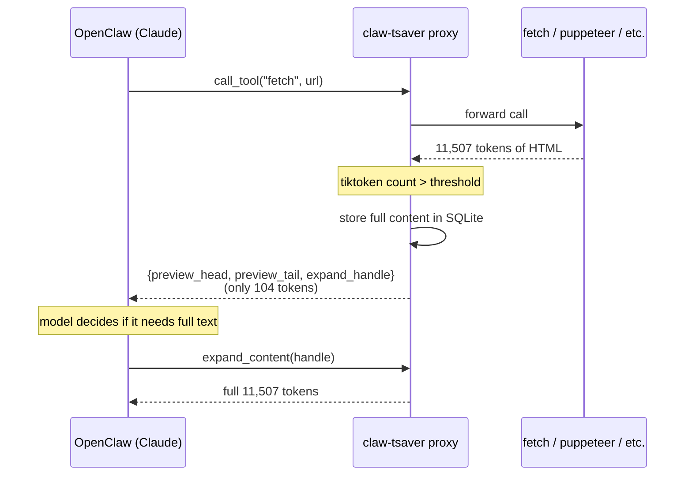

# claw-tsaver

> A token-saving MCP proxy for OpenClaw users. Cuts tool call payloads by 90%+ via lazy expansion.

## Why

MCP tool calls often return thousands of tokens of HTML or JSON in a single response — but the model typically uses only 5% of it. The remaining 95% silently burns context window and increases cost. claw-tsaver sits between OpenClaw and your downstream MCP servers, intercepts oversized responses, and hands the model a compact preview + an on-demand handle instead.

## How



## Real measurement

| Test | Original tokens | Returned tokens | Saved |
|---|---|---|---|
| fetch Wikipedia "Tokenization (data security)" | 11,507 | 104 | **99.1%** |

Tested on OpenClaw + Claude Sonnet 4.6 + mcp-server-fetch, 2026-04-25.  
Raw data: `benchmarks/mvp-day1-fetch.jsonl`.

## Quick Start

### 1. Prerequisites

Install [uv](https://docs.astral.sh/uv/) (one-time setup):

```bash
curl -LsSf https://astral.sh/uv/install.sh | sh
```

No claw-tsaver install needed — `uvx` will fetch and run it on demand.

### 2. Configure downstream MCP servers

Edit `~/.claw-tsaver/config.json` (first run of `claw-tsaver-mcp` will auto-create a template):

```json
{
  "downstream_servers": [
    {"name": "fetch", "command": "uvx", "args": ["mcp-server-fetch"]}
  ],
  "compression_threshold_tokens": 500
}
```

### 3. Register with OpenClaw

Add this block at the top level of `~/.openclaw/openclaw.json`:

```json
"mcp": {
  "servers": {
    "claw-tsaver": {
      "command": "uvx",
      "args": ["--from", "git+https://github.com/Yang1Bai/claw-tsaver",
               "claw-tsaver-mcp"]
    }
  }
}
```

Then restart OpenClaw gateway: `openclaw gateway restart`

## Dashboard

Optional: a local web UI for real-time token savings stats.

```bash
uvx --from git+https://github.com/Yang1Bai/claw-tsaver claw-tsaver-dashboard
```

Open <http://localhost:7878> in your browser.

## Roadmap

- [x] **Module A**: lazy expansion proxy (this release)
- [x] **Module D**: local dashboard (this release)
- [ ] **Module B**: tool routing (auto-load only relevant MCPs per turn)
- [ ] **Module C**: conversation history compression (atomic fact cards)

## License

MIT — see LICENSE file.

## Contributing

Issues and PRs welcome.

---

## 🇨🇳 中文说明

### 什么是 claw-tsaver？

**claw-tsaver** 是一个为 OpenClaw 用户设计的 MCP 代理，通过懒加载扩展机制将工具调用的 token 消耗削减 **90%+**。

### 问题背景

MCP 工具调用（如 fetch、puppeteer）经常在单次响应中返回数千个 token 的 HTML 或 JSON，但模型通常只使用其中约 5% 的内容。剩余 95% 悄悄消耗上下文窗口并增加费用。

### 解决方案

claw-tsaver 作为 OpenClaw 与下游 MCP 服务器之间的代理：
1. 拦截过大的响应（超过可配置的 token 阈值）
2. 将完整内容存储到本地 SQLite 数据库
3. 返回给模型一个**紧凑预览 + 按需扩展句柄**
4. 模型需要更多内容时，调用 `expand_content` 工具按需获取

### 快速安装

```bash
npm install -g claw-tsaver
# 在 OpenClaw 配置中添加为 MCP 服务器
```

### 开源协议

MIT License
